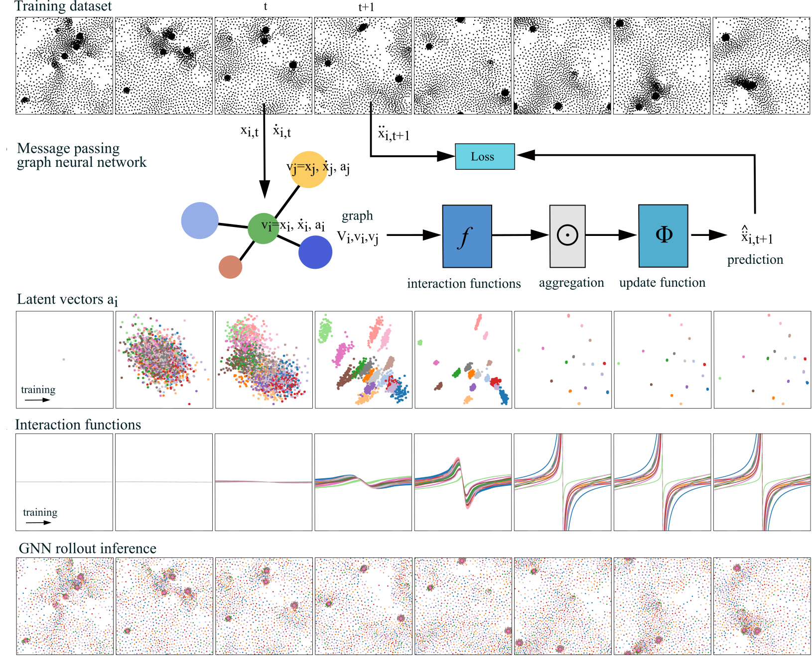

# Decomposing heterogeneous dynamical systems with graph neural networks
Cédric Allier, Magdalena C. Schneider, Michael Innerberger, Larissa Heinrich, John A. Bogovic, Stephan Saalfeld

Janelia Research Campus, Howard Hughes Medical Institute

To recreate the paper's figures run the scripts in `decomp_gnn/paper_experiments`. 
The output of all these scripts can be found on our summary page: https://saalfeldlab.github.io/decomp-gnn/



### Setup
Run the following line from the terminal to create a new environment `gnn`:
```
conda env create -f environment.yaml
```

Activate the environment:
```
conda activate gnn
```

Then, you should be able to import all the modules from the package in python:
```python
from ParticleGraph import *
```


### Citation
```
@article{allier2024decompgnn,
  author = {Allier, Cédric
            and Schneider, Magdalena C.
            and Innerberger, Michael
            and Heinrich, Larissa
            and Bogovic, John A.
            and Saalfeld Stephan},
  title = {Decomposing heterogeneous dynamical systems with graph neural networks},
  archiveprefix = {arXiv},
  eprint = {2102.04360},
  year = {2024}
}
```
